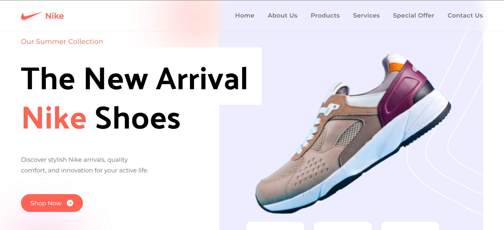

# Nike Website Clone 👟💻

A **single-page application** built using **Vite**, **React**, and **Tailwind CSS**. This project is a clone of the official Nike website, created to showcase my ability to build responsive, modern layouts using Tailwind’s utility-first CSS framework. The app is optimized for performance and scalability, using Vite’s fast build and development features.

## 🌐 Live Demo
Check out the live version of the project here: [Nike Website Clone](https://nike-website0-clone.netlify.app)

## 🚀 Features

- **Vite Setup**: Fast and efficient development with Vite’s lightning-quick build tools.
- **React**: Modular and reusable components for a scalable and maintainable codebase.
- **Tailwind CSS**: Fully styled using Tailwind's utility classes, emphasizing responsive design, clean layout, and custom configurations.
- **Responsive Design**: Works seamlessly across all devices, from mobile to desktop.

## 🎨 Technologies Used

- [Vite](https://vitejs.dev/) ⚡
- [React](https://reactjs.org/) ⚛️
- [Tailwind CSS](https://tailwindcss.com/) 🎨

## 📦 Installation

To get a local copy up and running, follow these simple steps:

1. Clone the repository:

   ```bash
   git clone https://github.com/yourusername/nike-website-clone.git
   ```

2. Navigate to the project directory:

   ```bash
   cd nike-website-clone
   ```

3. Install the dependencies:

   ```bash
   npm install
   ```

4. Run the development server:

   ```bash
   npm run dev
   ```

   The app will be available at `http://localhost:5173`.

## 🛠️ Build

To build the project for production, use:

```bash
npm run build
```

The optimized output will be in the `dist/` directory.

## 🖼️ Screenshots


